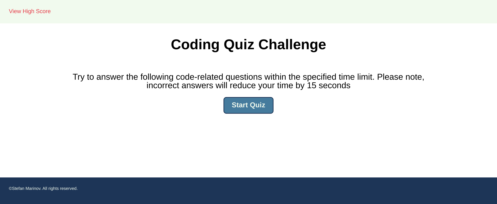
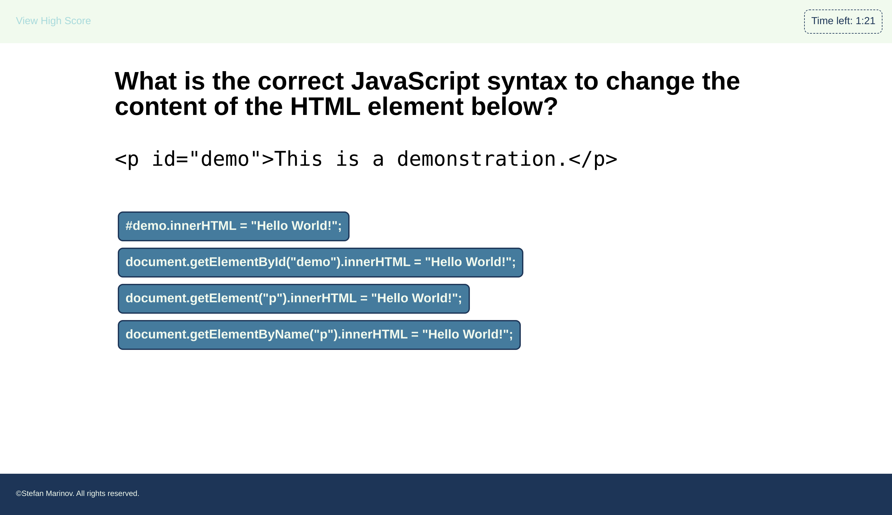
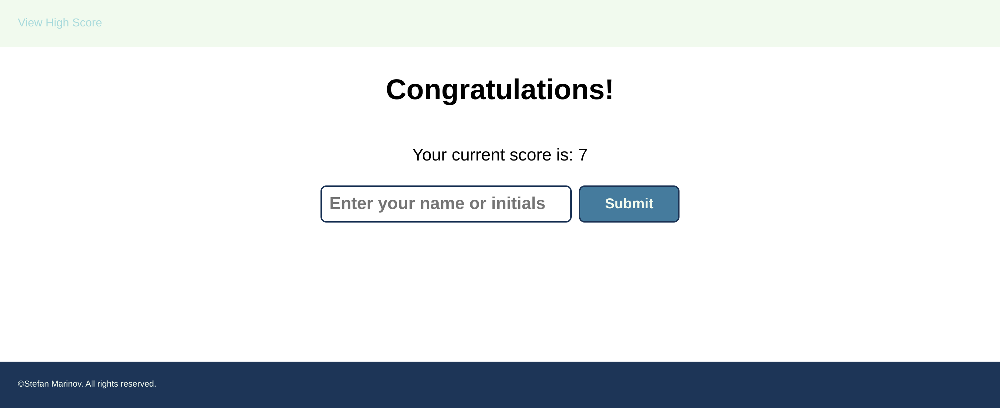
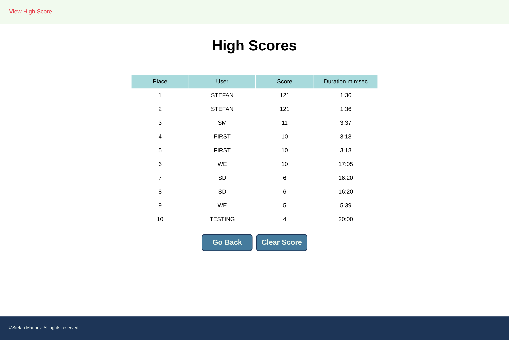

# UTOR-MOD04-CHAL01-JavaScript-Quiz

University of Toronto - Module 04 - Challenge 01 - JavaScript Quiz

## Description

Repository containing the code for the JavaScript quiz. The website is a single page that changes the look and feel based on the following states:

- quiz start: page displaying rules description and the start quiz button
- quiz questions: page displaying the quiz question and the multiple choice answers out of which only one is correct. The user has set amount of time to complete the quiz and each wrong answer reduces the timer
- quiz end: page displaying a short form letting the user know their score and enter their name
- quiz stats: page displaying the high scores

The website is done using HTML, CSS, and JavaScript. Extensive use of the Web/Browser API's are used to modify the page for the various components.

Below is the image of the application when the user lands on the page

Below is the image of the application when the user takes the quiz

Below is the image of the application when the user completes the quiz

Below is the image of the application when the user completes the quiz

## Table of Contents

- [Installation](#installation)
- [Functionality](#functionality)
- [Usage](#usage)
- [Credits](#credits)
- [License](#license)

## Installation

No installation requirements. Click the URL https://scorpionfiko.github.io/UTOR-MOD04-CHAL01-JavaScript-Quiz/ to open the webpage in your default browser.

## Functionality

The following discusses at a high level about some of the features of the website. Detailed code implementation can be found as comments in the CSS or JS files.

### Question Data:

The list of questions is housed in a separate data.js file. That way the data is separated from the code and can be updated easily. The list of questions is an array of JavaScript object containing information such as:

- the question
- the answer array (please note answers per question may vary)
- the position of the correct answer within the array
- the points (in case certain questions are deemed harder - they may require higher points)

### Page Transformation:

The basic layout of the central panel where the quiz questions and answer appear is this:

- the header: that takes on any headings or questions
- the body: that takes on all other information presented. That can be further subdivided into
  - the quiz introduction showing the "rules" of the quiz
  - the quiz answers that are presented as buttons
  - the quiz score and user name (or initial) entry form
  - the quiz high score to date (in case different people use the same computer to take the quiz)

### Local Storage:

Only the user scores are stored in local storage. Storing the questions to local storage has been considered, but ultimately rejected in favour of the data.js file. The one big consideration is that the questions have to be written to the JS code in order to be inserted or updated into the local storage item.

## Usage

For accessing the quiz: 

- go the the application at: https://scorpionfiko.github.io/UTOR-MOD04-CHAL01-JavaScript-Quiz/
- click "Start Quiz"
- complete the quiz by answering the questions
- once all the questions are answered or the timer runs out, the page changes to viewing the user score and entering user's name/initials
  - enter your name or initials; you will not be able to proceed unless you enter them
- once the submit button is pressed, the page will change to the high score summary

For accessing the high score summary: 

- go the the application at: https://scorpionfiko.github.io/UTOR-MOD04-CHAL01-JavaScript-Quiz/
- click on the "view high score" link at the top left corner
  - please note: the link is disabled during the quiz duration and user score summary (after all, the user shouldn't be distracted)

For viewing the responsiveness of the website: 
Method 1:

- Use separate computer, tablet, or phone to access the website

Method 2:

- Access the web page via web browser.
- Right click on the page and select "inspect" to open browser's developer tools
- Enable the device toolbar if not already enabled
- Use the device toolbar on the right to grow or shrink the viewable area and see how items change

## Credits

The quiz questions were obtained from W3 Schools website. At the time of creating the app, the quiz questions were available at https://www.w3schools.com/quiztest/quiztest.asp?qtest=JS

## License

Please refer to the LICENSE in the repo.

## Future Considerations

### Difficulty level

An improvement for the future will be for the user to select difficulty level. The difficulty level can be one of the following:

- more questions for less time
- questions requiring more complex code analysis
- questions having more than one correct answer

### Data.js

An improvement for the data.js - the quesiton/answer storage - is to modify the answer array to be an array of JavaScript objects showing the answer and whether that answer is correct or not. The future prototype is part of the displayPrototype() function.
